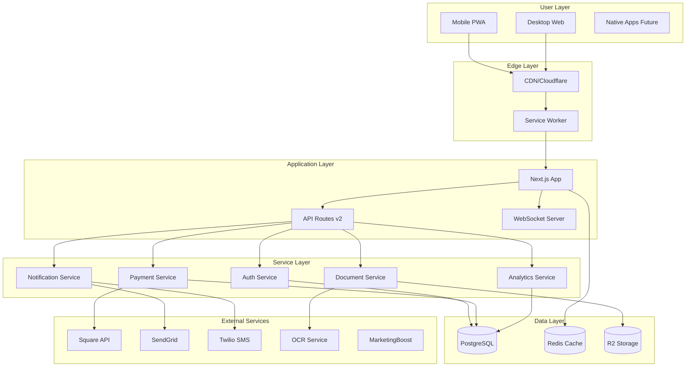

# Tax Genius Pro - Technical Architecture v2.0

## Executive Summary

This document outlines the technical architecture for transforming Tax Genius Pro from a generic B2B SaaS platform into an urgency-driven, mobile-first tax preparation ecosystem. The architecture prioritizes mobile performance, rapid feature delivery, and seamless integration with financial services while maintaining backward compatibility during migration.

## Current State Analysis

### Existing Technology Stack
- **Framework**: Next.js 15.5.3 (App Router)
- **Runtime**: Node.js with PM2
- **Database**: PostgreSQL via Prisma ORM
- **Styling**: Tailwind CSS with shadcn/ui
- **State Management**: React Query (TanStack Query)
- **Authentication**: Lucia Auth (partially implemented)
- **Deployment**: VPS on port 3005

### Technical Debt & Constraints
1. Missing service integrations (Square, SendGrid, Redis, R2)
2. No Spanish i18n implementation
3. Desktop-first component design
4. No offline capabilities
5. Missing real-time features (WebSocket)
6. No push notification system

## Target Architecture

### High-Level Architecture



### API Architecture

```
/api/v2/
├── auth/
│   ├── login/          # Email, phone, OAuth
│   ├── signup/         # Multi-step registration
│   ├── verify/         # SMS/email verification
│   └── session/        # Session management
├── advances/
│   ├── calculate/      # Estimate advance amount
│   ├── apply/          # Submit application
│   ├── status/         # Check approval status
│   └── disburse/       # Trigger payment
├── referrals/
│   ├── register/       # Public signup
│   ├── track/          # Click/conversion tracking
│   ├── vanity/         # Custom URLs
│   └── rewards/        # Calculate earnings
├── documents/
│   ├── upload/         # Multipart upload
│   ├── process/        # OCR processing
│   ├── verify/         # Document validation
│   └── retrieve/       # Secure download
├── payments/
│   ├── methods/        # Payment methods
│   ├── process/        # Square integration
│   ├── webhooks/       # Payment events
│   └── history/        # Transaction log
├── notifications/
│   ├── subscribe/      # Push subscriptions
│   ├── send/           # Trigger notifications
│   ├── templates/      # Message templates
│   └── preferences/    # User settings
├── marketing/
│   ├── campaigns/      # Campaign management
│   ├── landing/        # Dynamic pages
│   ├── tracking/       # Attribution
│   └── content/        # AI generation
└── preparers/
    ├── onboard/        # Registration flow
    ├── assign/         # Client matching
    ├── performance/    # Metrics tracking
    └── academy/        # Training modules
```

## Database Schema Updates

### New Tables Required

```sql
-- Cash Advances
CREATE TABLE advances (
    id UUID PRIMARY KEY DEFAULT gen_random_uuid(),
    user_id UUID REFERENCES users(id),
    amount DECIMAL(10,2) NOT NULL,
    status VARCHAR(20) NOT NULL, -- pending, approved, rejected, disbursed
    application_data JSONB,
    decision_data JSONB,
    applied_at TIMESTAMP DEFAULT NOW(),
    decided_at TIMESTAMP,
    disbursed_at TIMESTAMP,
    repayment_status VARCHAR(20),
    INDEX idx_advances_user (user_id),
    INDEX idx_advances_status (status)
);

-- Referral System
CREATE TABLE referrals (
    id UUID PRIMARY KEY DEFAULT gen_random_uuid(),
    referrer_id UUID REFERENCES users(id),
    referred_id UUID REFERENCES users(id),
    referral_code VARCHAR(50) UNIQUE,
    vanity_slug VARCHAR(100) UNIQUE,
    status VARCHAR(20), -- pending, converted, paid
    reward_amount DECIMAL(10,2),
    created_at TIMESTAMP DEFAULT NOW(),
    converted_at TIMESTAMP,
    INDEX idx_referrals_code (referral_code),
    INDEX idx_referrals_referrer (referrer_id)
);

-- Contests & Gamification
CREATE TABLE contests (
    id UUID PRIMARY KEY DEFAULT gen_random_uuid(),
    name VARCHAR(255),
    start_date TIMESTAMP,
    end_date TIMESTAMP,
    prize_pool JSONB,
    rules JSONB,
    status VARCHAR(20),
    created_at TIMESTAMP DEFAULT NOW()
);

CREATE TABLE contest_entries (
    id UUID PRIMARY KEY DEFAULT gen_random_uuid(),
    contest_id UUID REFERENCES contests(id),
    user_id UUID REFERENCES users(id),
    points INTEGER DEFAULT 0,
    rank INTEGER,
    updated_at TIMESTAMP DEFAULT NOW(),
    UNIQUE(contest_id, user_id)
);

-- Document Management
CREATE TABLE documents (
    id UUID PRIMARY KEY DEFAULT gen_random_uuid(),
    user_id UUID REFERENCES users(id),
    type VARCHAR(50), -- w2, 1099, etc
    storage_key VARCHAR(255),
    ocr_data JSONB,
    status VARCHAR(20), -- uploaded, processing, verified
    uploaded_at TIMESTAMP DEFAULT NOW(),
    verified_at TIMESTAMP,
    INDEX idx_documents_user (user_id)
);

-- Payment Transactions
CREATE TABLE transactions (
    id UUID PRIMARY KEY DEFAULT gen_random_uuid(),
    user_id UUID REFERENCES users(id),
    type VARCHAR(50), -- advance, repayment, fee, reward
    amount DECIMAL(10,2),
    square_transaction_id VARCHAR(255),
    status VARCHAR(20),
    metadata JSONB,
    created_at TIMESTAMP DEFAULT NOW(),
    INDEX idx_transactions_user (user_id),
    INDEX idx_transactions_square (square_transaction_id)
);

-- Push Subscriptions
CREATE TABLE push_subscriptions (
    id UUID PRIMARY KEY DEFAULT gen_random_uuid(),
    user_id UUID REFERENCES users(id),
    endpoint TEXT,
    keys JSONB,
    created_at TIMESTAMP DEFAULT NOW(),
    INDEX idx_push_user (user_id)
);

-- Marketing Campaigns
CREATE TABLE landing_pages (
    id UUID PRIMARY KEY DEFAULT gen_random_uuid(),
    slug VARCHAR(255) UNIQUE,
    city VARCHAR(100),
    state VARCHAR(2),
    content JSONB,
    meta_tags JSONB,
    created_at TIMESTAMP DEFAULT NOW(),
    INDEX idx_landing_slug (slug)
);
```

## Service Integration Architecture

### Payment Processing (Square)

```typescript
// services/payment.service.ts
class PaymentService {
  private square: Square;

  async processAdvance(userId: string, amount: number) {
    // 1. Create Square customer
    const customer = await this.square.customers.create({
      referenceId: userId
    });

    // 2. Create payment
    const payment = await this.square.payments.create({
      sourceId: savedCardToken,
      amountMoney: { amount: amount * 100, currency: 'USD' },
      customerId: customer.id
    });

    // 3. Record transaction
    await db.transactions.create({
      userId,
      type: 'advance',
      amount,
      squareTransactionId: payment.id
    });

    return payment;
  }
}
```

### Document Processing (R2 + OCR)

```typescript
// services/document.service.ts
class DocumentService {
  private r2: R2Storage;
  private ocr: OCRService;

  async processDocument(file: File, userId: string) {
    // 1. Upload to R2
    const key = `docs/${userId}/${Date.now()}-${file.name}`;
    await this.r2.upload(key, file, { encrypted: true });

    // 2. Extract text via OCR
    const ocrData = await this.ocr.extract(file);

    // 3. Parse tax data
    const taxData = this.parseTaxDocument(ocrData);

    // 4. Store metadata
    await db.documents.create({
      userId,
      type: taxData.type,
      storageKey: key,
      ocrData: taxData
    });

    return taxData;
  }
}
```

### Real-time Updates (WebSocket)

```typescript
// services/realtime.service.ts
class RealtimeService {
  private io: Server;

  setupHandlers() {
    this.io.on('connection', (socket) => {
      // Join user room
      socket.on('auth', async (token) => {
        const user = await validateToken(token);
        socket.join(`user:${user.id}`);
      });

      // Contest updates
      socket.on('join-contest', (contestId) => {
        socket.join(`contest:${contestId}`);
      });
    });
  }

  // Broadcast updates
  notifyAdvanceStatus(userId: string, status: string) {
    this.io.to(`user:${userId}`).emit('advance-update', { status });
  }

  updateLeaderboard(contestId: string, data: any) {
    this.io.to(`contest:${contestId}`).emit('leaderboard', data);
  }
}
```

### Push Notifications

```typescript
// services/notification.service.ts
class NotificationService {
  private webpush: WebPush;

  async sendPushNotification(userId: string, payload: any) {
    const subscriptions = await db.pushSubscriptions.findMany({
      where: { userId }
    });

    const notifications = subscriptions.map(sub =>
      this.webpush.sendNotification(sub, JSON.stringify(payload))
    );

    await Promise.all(notifications);
  }

  // Notification templates
  async notifyAdvanceApproved(userId: string, amount: number) {
    await this.sendPushNotification(userId, {
      title: '💰 Cash Approved!',
      body: `Your $${amount} advance is on the way!`,
      icon: '/icon-192.png',
      badge: '/badge-72.png',
      data: { url: '/dashboard/advance' }
    });
  }
}
```

## Performance Optimization Strategy

### Mobile Performance

```typescript
// next.config.ts
const nextConfig = {
  // Enable SWC minification
  swcMinify: true,

  // Optimize images
  images: {
    formats: ['image/webp'],
    deviceSizes: [640, 750, 1080, 1200],
    minimumCacheTTL: 60 * 60 * 24 * 30, // 30 days
  },

  // Bundle optimization
  experimental: {
    optimizeCss: true,
    optimizePackageImports: ['lucide-react', '@radix-ui/*'],
  },

  // Compression
  compress: true,

  // Headers for caching
  async headers() {
    return [
      {
        source: '/(.*).js',
        headers: [{
          key: 'Cache-Control',
          value: 'public, max-age=31536000, immutable',
        }],
      },
    ];
  },
};
```

### Code Splitting Strategy

```typescript
// Dynamic imports for heavy components
const QRGenerator = dynamic(() => import('@/components/QRGenerator'), {
  loading: () => <Skeleton />,
  ssr: false,
});

const DocumentScanner = dynamic(() => import('@/components/DocumentScanner'), {
  loading: () => <Skeleton />,
  ssr: false,
});

// Route-based splitting
const DashboardLayout = lazy(() => import('@/layouts/DashboardLayout'));
const ReferrerDashboard = lazy(() => import('@/features/referrer/Dashboard'));
```

### Caching Strategy

```typescript
// Redis caching layer
class CacheService {
  private redis: Redis;

  // Cache advance calculations
  async getAdvanceEstimate(userId: string) {
    const key = `advance:${userId}`;
    const cached = await this.redis.get(key);

    if (cached) return JSON.parse(cached);

    const estimate = await this.calculateAdvance(userId);
    await this.redis.setex(key, 3600, JSON.stringify(estimate));

    return estimate;
  }

  // Cache landing pages
  async getLandingPage(slug: string) {
    const key = `landing:${slug}`;
    const cached = await this.redis.get(key);

    if (cached) return JSON.parse(cached);

    const page = await db.landingPages.findUnique({ where: { slug } });
    await this.redis.setex(key, 86400, JSON.stringify(page));

    return page;
  }
}
```

## PWA Configuration

### Service Worker Strategy

```javascript
// public/sw.js
const CACHE_NAME = 'tax-genius-v2';
const OFFLINE_URL = '/offline.html';

// Cache strategies
const cacheStrategies = {
  // Network first for API calls
  networkFirst: ['/api/'],

  // Cache first for assets
  cacheFirst: ['/static/', '/_next/static/'],

  // Stale while revalidate for pages
  staleWhileRevalidate: ['/', '/dashboard'],
};

// Install event
self.addEventListener('install', (event) => {
  event.waitUntil(
    caches.open(CACHE_NAME).then((cache) => {
      return cache.addAll([
        OFFLINE_URL,
        '/manifest.json',
        '/icon-192.png',
        '/icon-512.png',
      ]);
    })
  );
});

// Fetch event with strategies
self.addEventListener('fetch', (event) => {
  const { request } = event;
  const url = new URL(request.url);

  // Apply appropriate strategy
  if (cacheStrategies.networkFirst.some(path => url.pathname.includes(path))) {
    event.respondWith(networkFirst(request));
  } else if (cacheStrategies.cacheFirst.some(path => url.pathname.includes(path))) {
    event.respondWith(cacheFirst(request));
  } else {
    event.respondWith(staleWhileRevalidate(request));
  }
});

// Background sync for uploads
self.addEventListener('sync', (event) => {
  if (event.tag === 'upload-documents') {
    event.waitUntil(uploadPendingDocuments());
  }
});
```

### Manifest Configuration

```json
{
  "name": "Tax Genius Pro - Get Cash Now",
  "short_name": "Tax Genius",
  "description": "Get up to $7,000 cash advance on your tax refund",
  "start_url": "/?source=pwa",
  "display": "standalone",
  "orientation": "portrait",
  "theme_color": "#FF4444",
  "background_color": "#FFFFFF",
  "icons": [
    {
      "src": "/icon-192.png",
      "sizes": "192x192",
      "type": "image/png",
      "purpose": "maskable"
    },
    {
      "src": "/icon-512.png",
      "sizes": "512x512",
      "type": "image/png"
    }
  ],
  "categories": ["finance", "productivity"],
  "screenshots": [
    {
      "src": "/screenshot-1.png",
      "sizes": "1080x1920",
      "type": "image/png"
    }
  ]
}
```

## Internationalization (i18n)

### Implementation Strategy

```typescript
// lib/i18n/config.ts
export const i18nConfig = {
  locales: ['en', 'es'],
  defaultLocale: 'en',
  messages: {
    en: () => import('./messages/en.json'),
    es: () => import('./messages/es.json'),
  },
};

// hooks/useTranslation.ts
export function useTranslation() {
  const locale = useLocale();
  const messages = useMemo(() => {
    return i18nConfig.messages[locale]();
  }, [locale]);

  const t = useCallback((key: string, params?: any) => {
    const message = get(messages, key);
    return params ? format(message, params) : message;
  }, [messages]);

  return { t, locale };
}
```

### Translation Structure

```json
// messages/es.json
{
  "home": {
    "hero": {
      "title": "Obtén hasta $7,000 HOY",
      "subtitle": "Adelanto en efectivo sobre tu reembolso de impuestos",
      "cta": "Obtener Efectivo Ahora"
    },
    "trust": {
      "users": "{{count}} personas obtuvieron efectivo en la última hora",
      "rating": "4.9 estrellas de {{total}} reseñas"
    }
  }
}
```

## Security Architecture

### Authentication Flow

```typescript
// Enhanced Lucia Auth configuration
export const auth = lucia({
  adapter: prismaAdapter(db),
  env: process.env.NODE_ENV === 'production' ? 'PROD' : 'DEV',
  middleware: nextjs(),

  sessionCookie: {
    expires: false, // Session cookies
    attributes: {
      secure: true,
      httpOnly: true,
      sameSite: 'lax',
    },
  },

  getUserAttributes: (user) => ({
    id: user.id,
    email: user.email,
    role: user.role,
    referralCode: user.referralCode,
  }),
});

// Multi-factor authentication
export async function verifyMFA(userId: string, code: string) {
  const user = await db.users.findUnique({ where: { id: userId } });
  const valid = await verifyTOTP(user.mfaSecret, code);

  if (!valid) throw new Error('Invalid MFA code');

  return createSession(userId);
}
```

### Data Encryption

```typescript
// Encryption service for sensitive data
class EncryptionService {
  private algorithm = 'aes-256-gcm';
  private key: Buffer;

  constructor() {
    this.key = Buffer.from(process.env.ENCRYPTION_KEY, 'hex');
  }

  encrypt(text: string): string {
    const iv = crypto.randomBytes(16);
    const cipher = crypto.createCipheriv(this.algorithm, this.key, iv);

    let encrypted = cipher.update(text, 'utf8', 'hex');
    encrypted += cipher.final('hex');

    const authTag = cipher.getAuthTag();

    return iv.toString('hex') + ':' + authTag.toString('hex') + ':' + encrypted;
  }

  decrypt(encryptedData: string): string {
    const parts = encryptedData.split(':');
    const iv = Buffer.from(parts[0], 'hex');
    const authTag = Buffer.from(parts[1], 'hex');
    const encrypted = parts[2];

    const decipher = crypto.createDecipheriv(this.algorithm, this.key, iv);
    decipher.setAuthTag(authTag);

    let decrypted = decipher.update(encrypted, 'hex', 'utf8');
    decrypted += decipher.final('utf8');

    return decrypted;
  }
}
```

## Migration Strategy

### Phase 1: Foundation (Week 1)
1. Set up service credentials (Square, SendGrid, Redis, R2)
2. Run database migrations for new tables
3. Deploy API v2 routes alongside existing
4. Implement feature flags for gradual rollout

### Phase 2: Core Features (Week 2)
1. Deploy authentication enhancements
2. Launch cash advance flow behind feature flag
3. Activate payment processing
4. Enable document upload with OCR

### Phase 3: Growth Features (Week 3)
1. Public referral system activation
2. Email campaign setup
3. Push notification implementation
4. Contest system launch

### Phase 4: Optimization (Week 4+)
1. PWA deployment
2. Performance monitoring
3. A/B testing implementation
4. Gradual migration of remaining features

## Monitoring & Observability

### Metrics to Track

```typescript
// Performance metrics
const metrics = {
  // Business metrics
  advanceApplications: new Counter('advance_applications_total'),
  advanceApprovals: new Counter('advance_approvals_total'),
  referralConversions: new Counter('referral_conversions_total'),

  // Technical metrics
  apiLatency: new Histogram('api_request_duration_seconds'),
  cacheHitRate: new Gauge('cache_hit_rate'),
  documentProcessingTime: new Histogram('document_processing_seconds'),

  // User metrics
  activeUsers: new Gauge('active_users'),
  mobileUsageRate: new Gauge('mobile_usage_rate'),
  pwaCoversionRate: new Gauge('pwa_conversion_rate'),
};
```

### Error Tracking

```typescript
// Sentry configuration
Sentry.init({
  dsn: process.env.SENTRY_DSN,
  environment: process.env.NODE_ENV,
  tracesSampleRate: 0.1,

  beforeSend(event, hint) {
    // Sanitize sensitive data
    if (event.request) {
      delete event.request.cookies;
      delete event.request.headers?.authorization;
    }
    return event;
  },
});
```

## DevOps Configuration

### Environment Variables

```bash
# Core
NODE_ENV=production
DATABASE_URL=postgresql://...
REDIS_URL=redis://...

# Authentication
AUTH_SECRET=...
GOOGLE_CLIENT_ID=...
GOOGLE_CLIENT_SECRET=...

# Payment
SQUARE_ACCESS_TOKEN=...
SQUARE_APPLICATION_ID=...
SQUARE_LOCATION_ID=...
SQUARE_WEBHOOK_SECRET=...

# Storage
R2_ACCOUNT_ID=...
R2_ACCESS_KEY_ID=...
R2_SECRET_ACCESS_KEY=...
R2_BUCKET_NAME=...

# Communications
SENDGRID_API_KEY=...
TWILIO_ACCOUNT_SID=...
TWILIO_AUTH_TOKEN=...
TWILIO_PHONE_NUMBER=...

# Push Notifications
VAPID_PUBLIC_KEY=...
VAPID_PRIVATE_KEY=...
VAPID_SUBJECT=...

# Monitoring
SENTRY_DSN=...
GOOGLE_ANALYTICS_ID=...

# Encryption
ENCRYPTION_KEY=...
```

### Deployment Configuration

```yaml
# pm2.config.js
module.exports = {
  apps: [{
    name: 'taxgeniuspro',
    script: 'npm',
    args: 'start',
    env: {
      PORT: 3005,
      NODE_ENV: 'production',
    },
    instances: 2,
    exec_mode: 'cluster',
    autorestart: true,
    watch: false,
    max_memory_restart: '1G',
    error_file: './logs/err.log',
    out_file: './logs/out.log',
    log_file: './logs/combined.log',
    time: true,
  }],
};
```

## Conclusion

This architecture provides a robust foundation for transforming Tax Genius Pro into a mobile-first, urgency-driven platform while maintaining stability during migration. The phased approach ensures continuous operation while new features are rolled out progressively.