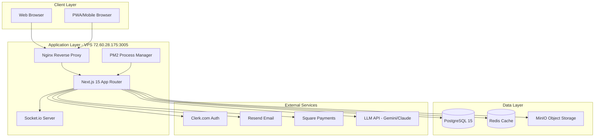

# Tax Genius Platform - Architecture Overview

**Version:** 3.0 FINAL
**Date:** October 9, 2025
**Status:** Active - Single Source of Truth
**Part:** 1 of 11

[↑ Back to Architecture Index](./README.md)

---

## 1. Executive Summary

This document defines the **authoritative architecture** for the Tax Genius Platform, a SaaS application connecting tax clients, preparers, and referrers through a comprehensive web platform. This version consolidates all previous architectural decisions and aligns with the MVP requirements defined in `/docs/prd/mvp-requirements.md`.

### Key Architectural Decisions

- **Framework:** Next.js 15+ with App Router (Server Components + Server Actions)
- **Deployment:** Self-hosted on VPS (72.60.28.175:3005)
- **Database:** PostgreSQL 15+ with Prisma ORM
- **Authentication:** Clerk.com (migrating from Lucia)
- **Storage:** MinIO (self-hosted S3-compatible)
- **Email:** Resend (already installed, activating)
- **Real-time:** Socket.io + Web Push Notifications

---

## 2. System Architecture Overview



---

## 3. Technology Stack (Definitive)

### 3.1 Core Framework

| Component | Technology | Version | Purpose |
|-----------|-----------|---------|----------|
| **Framework** | Next.js | 15.5.3+ | React framework with App Router |
| **Runtime** | Node.js | 20 LTS | Server runtime |
| **Language** | TypeScript | 5+ | Type-safe development |
| **UI Library** | React | 19.1.0+ | Component library |
| **Build Tool** | Turbopack | Built-in | Fast refresh & builds |

### 3.2 Frontend Stack

| Component | Technology | Purpose |
|-----------|-----------|----------|
| **Styling** | Tailwind CSS 4+ | Utility-first CSS |
| **Components** | shadcn/ui + Radix UI | Accessible component primitives |
| **Icons** | Lucide React | Icon library |
| **Forms** | React Hook Form + Zod | Form state + validation |
| **State Management** | @tanstack/react-query | Server state management |
| **Client State** | React Context | Global client state (minimal) |
| **Animation** | Framer Motion | UI animations |

### 3.3 Backend & Database

| Component | Technology | Purpose |
|-----------|-----------|----------|
| **Database** | PostgreSQL 15+ | Primary relational database |
| **ORM** | Prisma 6+ | Type-safe database client |
| **Cache** | Redis 7+ (ioredis) | Session storage & caching |
| **Storage** | MinIO | S3-compatible object storage |
| **Queue** | Bull + Redis | Background job processing |

### 3.4 Authentication & Security

| Component | Technology | Purpose |
|-----------|-----------|----------|
| **Auth Provider** | Clerk.com | Authentication & user management |
| **Session** | Clerk sessions (JWT) | Secure session management |
| **Encryption** | node:crypto | PII/SSN encryption |
| **Password Hashing** | scrypt (built-in) | Secure password storage |
| **Rate Limiting** | Next.js middleware | API protection |

### 3.5 Communication & Real-time

| Component | Technology | Purpose |
|-----------|-----------|----------|
| **Email Service** | Resend | Transactional emails |
| **Email Templates** | @react-email/components | React-based email templates |
| **Real-time** | Socket.io | Live notifications & chat |
| **Push Notifications** | web-push | PWA push notifications |

### 3.6 Payments & Billing

| Component | Technology | Purpose |
|-----------|-----------|----------|
| **Payment Gateway** | Square | Payment processing |
| **Subscriptions** | Square Subscriptions API | Recurring billing |
| **Checkout** | Square Web Payments SDK | Hosted checkout |

### 3.7 DevOps & Infrastructure

| Component | Technology | Purpose |
|-----------|-----------|----------|
| **Hosting** | Self-hosted VPS | Production environment |
| **Process Manager** | PM2 | Node.js process management |
| **Reverse Proxy** | Nginx | SSL termination & routing |
| **SSL** | Let's Encrypt | HTTPS certificates |
| **CI/CD** | GitHub Actions | Automated deployment |
| **Monitoring** | PM2 logs | Application monitoring |

### 3.8 Testing & Quality

| Component | Technology | Purpose |
|-----------|-----------|----------|
| **Unit Tests** | Jest + React Testing Library | Component & unit testing |
| **E2E Tests** | Playwright | End-to-end testing |
| **Linting** | ESLint 9 | Code quality |
| **Formatting** | Prettier | Code formatting |

### 3.9 AI & Content Generation

| Component | Technology | Purpose |
|-----------|-----------|----------|
| **LLM Provider** | Google Gemini API | AI content generation |
| **Alternative** | Claude API (Anthropic) | Backup LLM provider |
| **Content Storage** | PostgreSQL | Generated content storage |

---

## 4. Project Structure

```
/root/websites/taxgeniuspro/
├── docs/                           # Documentation (this file!)
│   ├── architecture/               # Architecture documents (sharded)
│   │   ├── 01-overview.md         # This document
│   │   ├── 02-database-schema.md
│   │   ├── 03-api-design.md
│   │   ├── 04-storage-minio.md
│   │   ├── 05-authentication-clerk.md
│   │   ├── 06-email-resend.md
│   │   ├── 07-security.md
│   │   ├── 08-deployment.md
│   │   ├── 09-performance.md
│   │   ├── 10-ai-content.md
│   │   └── 11-monitoring.md
│   ├── tech-stack-v3.md           # Detailed tech stack
│   ├── migration-guide.md         # Migration instructions
│   ├── prd/                       # Product requirements
│   │   ├── mvp-requirements.md    # MVP specification
│   │   ├── epic-1-core-foundation.md
│   │   ├── epic-2-referrer-engine.md
│   │   ├── epic-3-client-preparer-workflow.md
│   │   └── epic-4-marketing-growth.md
│   └── archive/                   # Archived docs
│
├── src/
│   ├── app/                       # Next.js App Router
│   │   ├── (marketing)/          # Public marketing pages
│   │   ├── auth/                 # Authentication pages
│   │   ├── dashboard/            # Role-based dashboards
│   │   │   ├── client/
│   │   │   ├── preparer/
│   │   │   └── referrer/
│   │   ├── admin/                # Admin tools
│   │   │   └── content-generator/  # AI content tool
│   │   ├── locations/            # Dynamic landing pages
│   │   │   └── [city]/
│   │   ├── api/                  # API routes
│   │   │   ├── auth/
│   │   │   ├── webhooks/
│   │   │   ├── referrals/
│   │   │   └── payments/
│   │   ├── layout.tsx
│   │   └── page.tsx
│   │
│   ├── components/
│   │   ├── ui/                   # shadcn/ui components
│   │   ├── features/             # Feature-specific components
│   │   ├── layout/               # Layout components
│   │   └── shared/               # Shared components
│   │
│   ├── lib/
│   │   ├── auth.ts               # Clerk integration
│   │   ├── db.ts                 # Prisma client
│   │   ├── redis.ts              # Redis client
│   │   ├── storage.ts            # MinIO integration
│   │   └── services/             # Business logic services
│   │       ├── email.service.ts
│   │       ├── payment.service.ts
│   │       ├── referral.service.ts
│   │       └── ai-content.service.ts
│   │
│   ├── hooks/                    # React hooks
│   ├── utils/                    # Utility functions
│   └── types/                    # TypeScript types
│
├── prisma/
│   ├── schema.prisma             # Database schema
│   └── migrations/               # Database migrations
│
├── public/                       # Static assets
├── emails/                       # React Email templates
├── tests/                        # Test files
│   ├── unit/
│   ├── integration/
│   └── e2e/
│
├── .env.local                    # Environment variables
├── next.config.mjs               # Next.js configuration
├── tailwind.config.ts            # Tailwind configuration
├── tsconfig.json                 # TypeScript configuration
└── package.json                  # Dependencies
```

---

## Related Documentation

- [Database Schema](./02-database-schema.md) - Prisma models and relationships
- [API Design Patterns](./03-api-design.md) - API routes and response formats
- [Storage Architecture](./04-storage-minio.md) - MinIO configuration
- [Authentication Flow](./05-authentication-clerk.md) - Clerk integration
- [Email Architecture](./06-email-resend.md) - Resend service
- [Security Architecture](./07-security.md) - Security layers and encryption
- [Deployment Architecture](./08-deployment.md) - PM2 and Nginx
- [Performance Optimization](./09-performance.md) - Caching strategies
- [AI Content Generation](./10-ai-content.md) - AI integration
- [Monitoring & Observability](./11-monitoring.md) - Logging and health checks

---

**Navigation:**
[Next: Database Schema →](./02-database-schema.md)

---

**Document Version:** 3.0 FINAL
**Last Updated:** October 9, 2025
**Next Review:** November 9, 2025
**Maintained By:** Development Team
