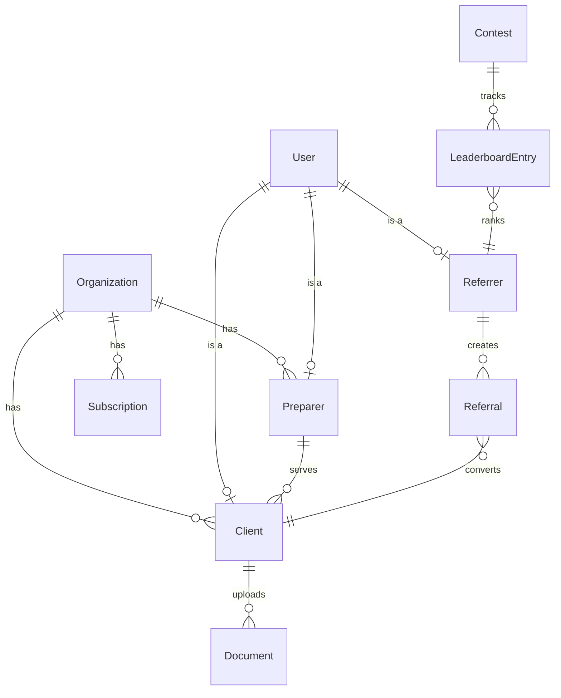

# Tax Genius Platform - Database Schema

**Version:** 3.0 FINAL
**Date:** October 9, 2025
**Status:** Active - Single Source of Truth
**Part:** 2 of 11

[↑ Back to Architecture Index](./README.md)

---

## 5. Database Architecture

### 5.1 Core Schema (Prisma)

```prisma
// Core user and organization models

model Organization {
  id              String    @id @default(cuid())
  name            String
  slug            String    @unique
  plan            Plan      @default(TRIAL)
  trialEndsAt     DateTime?
  createdAt       DateTime  @default(now())
  updatedAt       DateTime  @updatedAt

  preparers       Preparer[]
  clients         Client[]
  subscriptions   Subscription[]

  @@index([slug])
  @@index([plan])
}

model User {
  id              String    @id @default(cuid())
  clerkUserId     String    @unique
  email           String    @unique
  name            String
  role            UserRole
  photoUrl        String?
  createdAt       DateTime  @default(now())
  updatedAt       DateTime  @updatedAt

  preparer        Preparer?
  client          Client?
  referrer        Referrer?

  @@index([clerkUserId])
  @@index([email])
  @@index([role])
}

enum UserRole {
  CLIENT
  PREPARER
  REFERRER
  ADMIN
}

enum Plan {
  TRIAL
  STARTER
  PROFESSIONAL
  ENTERPRISE
}

// Preparer model
model Preparer {
  id              String    @id @default(cuid())
  userId          String    @unique
  organizationId  String
  ptin            String?
  credentials     Json?
  yearsExperience Int?
  serviceAreas    String[]
  pricing         Json?
  bio             String?

  user            User      @relation(fields: [userId], references: [id])
  organization    Organization @relation(fields: [organizationId], references: [id])
  clients         Client[]

  @@index([organizationId])
}

// Client model
model Client {
  id              String    @id @default(cuid())
  userId          String    @unique
  preparerId      String?
  organizationId  String
  pipelineStage   PipelineStage @default(NEW)
  referredBy      String?

  user            User      @relation(fields: [userId], references: [id])
  preparer        Preparer? @relation(fields: [preparerId], references: [id])
  organization    Organization @relation(fields: [organizationId], references: [id])
  documents       Document[]
  questionnaire   Questionnaire?

  @@index([preparerId])
  @@index([organizationId])
  @@index([pipelineStage])
}

enum PipelineStage {
  NEW
  CONTACTED
  DOCUMENTS
  PREPARING
  COMPLETE
}

// Referrer model
model Referrer {
  id              String    @id @default(cuid())
  userId          String    @unique
  vanitySlug      String?   @unique
  totalReferrals  Int       @default(0)
  totalEarnings   Float     @default(0)

  user            User      @relation(fields: [userId], references: [id])
  referrals       Referral[]

  @@index([vanitySlug])
}

// Referral tracking
model Referral {
  id              String    @id @default(cuid())
  referrerId      String
  clientId        String?
  referralCode    String
  status          ReferralStatus @default(PENDING)
  commission      Float     @default(0)
  createdAt       DateTime  @default(now())
  convertedAt     DateTime?

  referrer        Referrer  @relation(fields: [referrerId], references: [id])

  @@index([referrerId])
  @@index([referralCode])
  @@index([status])
}

enum ReferralStatus {
  PENDING
  CONVERTED
  PAID
}

// Document storage
model Document {
  id              String    @id @default(cuid())
  clientId        String
  preparerId      String?
  filename        String
  minioKey        String
  fileSize        Int
  mimeType        String
  documentType    String?
  uploadedAt      DateTime  @default(now())

  client          Client    @relation(fields: [clientId], references: [id])

  @@index([clientId])
  @@index([preparerId])
}

// Subscription management
model Subscription {
  id                    String    @id @default(cuid())
  organizationId        String
  squareSubscriptionId  String    @unique
  plan                  Plan
  status                SubscriptionStatus
  currentPeriodStart    DateTime
  currentPeriodEnd      DateTime
  cancelAtPeriodEnd     Boolean   @default(false)
  clientCount           Int       @default(0)
  storageUsedMB         Float     @default(0)

  organization          Organization @relation(fields: [organizationId], references: [id])

  @@index([organizationId])
  @@index([status])
}

enum SubscriptionStatus {
  TRIALING
  ACTIVE
  PAST_DUE
  CANCELED
  PAUSED
}

// Landing page content
model LandingPage {
  id              String    @id @default(cuid())
  slug            String    @unique
  city            String
  state           String
  title           String
  metaDescription String
  content         Json      // AI-generated content
  qaAccordion     Json      // Q&A data
  createdAt       DateTime  @default(now())
  updatedAt       DateTime  @updatedAt
  published       Boolean   @default(false)

  @@index([slug])
  @@index([city])
  @@index([published])
}

// Contest system
model Contest {
  id              String    @id @default(cuid())
  name            String
  description     String
  startDate       DateTime
  endDate         DateTime
  rules           Json
  prizes          Json
  active          Boolean   @default(true)

  leaderboard     LeaderboardEntry[]

  @@index([active])
  @@index([startDate])
}

model LeaderboardEntry {
  id              String    @id @default(cuid())
  contestId       String
  referrerId      String
  score           Int       @default(0)
  rank            Int?

  contest         Contest   @relation(fields: [contestId], references: [id])

  @@unique([contestId, referrerId])
  @@index([contestId])
  @@index([rank])
}
```

---

## Database Relationships

### Core Entity Relationships



### Key Indexes

The schema includes strategic indexes for optimal query performance:

- **User lookups:** `clerkUserId`, `email`, `role`
- **Organization queries:** `slug`, `plan`
- **Client management:** `preparerId`, `organizationId`, `pipelineStage`
- **Referral tracking:** `referrerId`, `referralCode`, `status`
- **Content discovery:** `slug`, `city`, `published` (LandingPage)

---

## Data Access Patterns

### Example Queries

```typescript
// Get preparer with all clients
const preparer = await prisma.preparer.findUnique({
  where: { userId: user.id },
  include: {
    clients: {
      include: {
        user: true,
        documents: true,
      },
    },
    organization: true,
  },
});

// Get referrer dashboard stats
const referrer = await prisma.referrer.findUnique({
  where: { userId: user.id },
  include: {
    referrals: {
      where: {
        status: 'CONVERTED',
      },
      include: {
        client: {
          include: {
            user: true,
          },
        },
      },
    },
  },
});

// Get organization with subscription
const org = await prisma.organization.findUnique({
  where: { slug: orgSlug },
  include: {
    subscriptions: {
      where: {
        status: 'ACTIVE',
      },
      orderBy: {
        currentPeriodEnd: 'desc',
      },
      take: 1,
    },
    preparers: true,
    clients: true,
  },
});
```

---

## Migration Strategy

### Initial Migration

```bash
# Generate initial migration
npx prisma migrate dev --name init

# Apply to production
npx prisma migrate deploy
```

### Schema Updates

```bash
# Create new migration after schema changes
npx prisma migrate dev --name add_new_feature

# Generate Prisma Client
npx prisma generate
```

---

## Related Documentation

- [Overview](./01-overview.md) - System architecture overview
- [API Design Patterns](./03-api-design.md) - API routes and endpoints
- [Storage Architecture](./04-storage-minio.md) - Document storage with MinIO
- [Security Architecture](./07-security.md) - Data encryption and protection

---

**Navigation:**
[← Previous: Overview](./01-overview.md) | [Next: API Design →](./03-api-design.md)

---

**Document Version:** 3.0 FINAL
**Last Updated:** October 9, 2025
**Next Review:** November 9, 2025
**Maintained By:** Development Team
