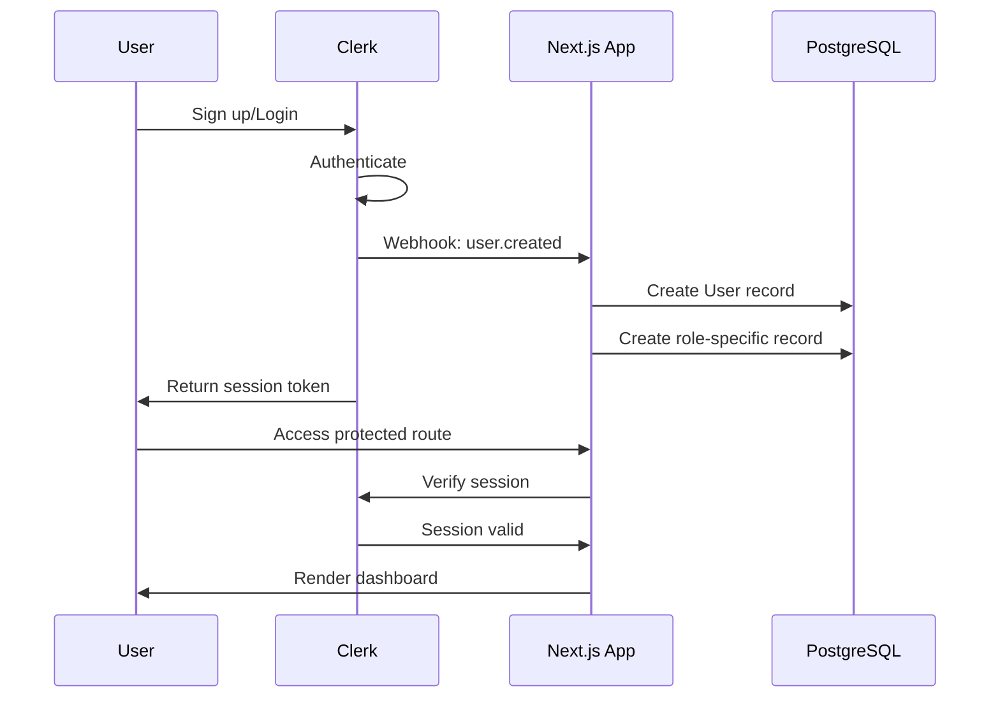

# Tax Genius Platform - Authentication Flow (Clerk)

**Version:** 3.0 FINAL
**Date:** October 9, 2025
**Status:** Active - Single Source of Truth
**Part:** 5 of 11

[↑ Back to Architecture Index](./README.md)

---

## 6. Authentication Flow (Clerk)

### 6.1 User Registration & Login



### 6.2 Clerk Configuration

```typescript
// src/middleware.ts
import { clerkMiddleware, createRouteMatcher } from '@clerk/nextjs/server';

const isPublicRoute = createRouteMatcher([
  '/',
  '/locations(.*)',
  '/contact',
  '/api/webhooks(.*)',
]);

export default clerkMiddleware((auth, request) => {
  if (!isPublicRoute(request)) {
    auth().protect();
  }
});

export const config = {
  matcher: [
    '/((?!_next|[^?]*\\.(?:html?|css|js(?!on)|jpe?g|webp|png|gif|svg|ttf|woff2?|ico|csv|docx?|xlsx?|zip|webmanifest)).*)',
    '/(api|trpc)(.*)',
  ],
};
```

---

## Authentication Implementation

### Clerk Provider Setup

```typescript
// src/app/layout.tsx
import { ClerkProvider } from '@clerk/nextjs';

export default function RootLayout({ children }) {
  return (
    <ClerkProvider>
      <html lang="en">
        <body>{children}</body>
      </html>
    </ClerkProvider>
  );
}
```

### Protected Routes

```typescript
// src/app/dashboard/client/page.tsx
import { auth } from '@clerk/nextjs/server';
import { redirect } from 'next/navigation';
import { prisma } from '@/lib/db';

export default async function ClientDashboard() {
  const { userId } = auth();

  if (!userId) {
    redirect('/sign-in');
  }

  // Fetch user from database
  const user = await prisma.user.findUnique({
    where: { clerkUserId: userId },
    include: {
      client: {
        include: {
          preparer: true,
          documents: true,
        },
      },
    },
  });

  if (!user || user.role !== 'CLIENT') {
    redirect('/');
  }

  return <div>Welcome, {user.name}!</div>;
}
```

### Role-Based Access Control

```typescript
// src/lib/auth.ts
import { auth } from '@clerk/nextjs/server';
import { prisma } from '@/lib/db';
import { UserRole } from '@prisma/client';

export async function getCurrentUser() {
  const { userId } = auth();

  if (!userId) {
    return null;
  }

  return prisma.user.findUnique({
    where: { clerkUserId: userId },
  });
}

export async function requireRole(role: UserRole) {
  const user = await getCurrentUser();

  if (!user || user.role !== role) {
    throw new Error('Unauthorized');
  }

  return user;
}

export async function hasRole(role: UserRole): Promise<boolean> {
  const user = await getCurrentUser();
  return user?.role === role;
}
```

---

## Webhook Integration

### User Lifecycle Webhooks

```typescript
// src/app/api/auth/webhook/route.ts
import { Webhook } from 'svix';
import { headers } from 'next/headers';
import { prisma } from '@/lib/db';
import type { WebhookEvent } from '@clerk/nextjs/server';

export async function POST(req: Request) {
  const WEBHOOK_SECRET = process.env.CLERK_WEBHOOK_SECRET;

  if (!WEBHOOK_SECRET) {
    throw new Error('CLERK_WEBHOOK_SECRET is not set');
  }

  // Get headers
  const headerPayload = headers();
  const svix_id = headerPayload.get('svix-id');
  const svix_timestamp = headerPayload.get('svix-timestamp');
  const svix_signature = headerPayload.get('svix-signature');

  if (!svix_id || !svix_timestamp || !svix_signature) {
    return new Response('Missing svix headers', { status: 400 });
  }

  // Get body
  const payload = await req.json();
  const body = JSON.stringify(payload);

  // Verify webhook
  const wh = new Webhook(WEBHOOK_SECRET);

  let evt: WebhookEvent;

  try {
    evt = wh.verify(body, {
      'svix-id': svix_id,
      'svix-timestamp': svix_timestamp,
      'svix-signature': svix_signature,
    }) as WebhookEvent;
  } catch (err) {
    console.error('Webhook verification failed:', err);
    return new Response('Webhook verification failed', { status: 400 });
  }

  // Handle different event types
  switch (evt.type) {
    case 'user.created':
      await handleUserCreated(evt.data);
      break;

    case 'user.updated':
      await handleUserUpdated(evt.data);
      break;

    case 'user.deleted':
      await handleUserDeleted(evt.data);
      break;

    default:
      console.log('Unhandled webhook event:', evt.type);
  }

  return new Response('Webhook processed', { status: 200 });
}

async function handleUserCreated(data: any) {
  const { id, email_addresses, first_name, last_name, image_url } = data;

  await prisma.user.create({
    data: {
      clerkUserId: id,
      email: email_addresses[0].email_address,
      name: `${first_name} ${last_name}`,
      photoUrl: image_url,
      role: 'CLIENT', // Default role
    },
  });
}

async function handleUserUpdated(data: any) {
  const { id, email_addresses, first_name, last_name, image_url } = data;

  await prisma.user.update({
    where: { clerkUserId: id },
    data: {
      email: email_addresses[0].email_address,
      name: `${first_name} ${last_name}`,
      photoUrl: image_url,
    },
  });
}

async function handleUserDeleted(data: any) {
  const { id } = data;

  await prisma.user.delete({
    where: { clerkUserId: id },
  });
}
```

---

## User Profile Management

### Profile Component

```typescript
// src/components/features/UserProfile.tsx
'use client';

import { useUser } from '@clerk/nextjs';
import { UserButton } from '@clerk/nextjs';

export function UserProfile() {
  const { isLoaded, isSignedIn, user } = useUser();

  if (!isLoaded || !isSignedIn) {
    return null;
  }

  return (
    <div className="flex items-center gap-4">
      <span>Welcome, {user.firstName}!</span>
      <UserButton afterSignOutUrl="/" />
    </div>
  );
}
```

---

## Session Management

### Server-Side Session Access

```typescript
// src/app/api/user/profile/route.ts
import { auth, currentUser } from '@clerk/nextjs/server';
import { NextResponse } from 'next/server';
import { prisma } from '@/lib/db';

export async function GET() {
  const { userId } = auth();

  if (!userId) {
    return NextResponse.json(
      { success: false, error: 'Unauthorized' },
      { status: 401 }
    );
  }

  // Get Clerk user
  const clerkUser = await currentUser();

  // Get database user
  const dbUser = await prisma.user.findUnique({
    where: { clerkUserId: userId },
  });

  return NextResponse.json({
    success: true,
    data: {
      clerk: clerkUser,
      profile: dbUser,
    },
  });
}
```

---

## Multi-Factor Authentication

### Enabling MFA

Clerk provides built-in MFA support:

- SMS verification
- TOTP authenticator apps
- Backup codes

Configure in Clerk Dashboard:
1. Enable MFA in Authentication settings
2. Choose verification methods
3. Customize MFA UI (optional)

---

## Custom Claims & Metadata

### Adding Role to JWT

```typescript
// Configure in Clerk Dashboard > JWT Templates
// Add custom claim:
{
  "role": "{{user.public_metadata.role}}"
}
```

### Setting User Metadata

```typescript
// src/lib/clerk-utils.ts
import { clerkClient } from '@clerk/nextjs/server';

export async function setUserRole(userId: string, role: string) {
  await clerkClient.users.updateUserMetadata(userId, {
    publicMetadata: {
      role,
    },
  });
}
```

---

## Authentication Best Practices

### Security Checklist

- ✅ Use HTTPS in production
- ✅ Verify webhook signatures
- ✅ Store minimal user data
- ✅ Implement rate limiting on auth endpoints
- ✅ Use short-lived session tokens
- ✅ Enable MFA for admin users
- ✅ Monitor suspicious login attempts
- ✅ Implement proper CORS policies

### Error Handling

```typescript
// src/lib/auth-errors.ts
export class AuthError extends Error {
  constructor(message: string, public code: string) {
    super(message);
    this.name = 'AuthError';
  }
}

export const AuthErrorCodes = {
  UNAUTHORIZED: 'UNAUTHORIZED',
  FORBIDDEN: 'FORBIDDEN',
  INVALID_TOKEN: 'INVALID_TOKEN',
  SESSION_EXPIRED: 'SESSION_EXPIRED',
} as const;
```

---

## Related Documentation

- [Database Schema](./02-database-schema.md) - User model
- [API Design Patterns](./03-api-design.md) - Protected endpoints
- [Security Architecture](./07-security.md) - Security best practices
- [Deployment Architecture](./08-deployment.md) - Environment variables

---

**Navigation:**
[← Previous: Storage Architecture](./04-storage-minio.md) | [Next: Email Architecture →](./06-email-resend.md)

---

**Document Version:** 3.0 FINAL
**Last Updated:** October 9, 2025
**Next Review:** November 9, 2025
**Maintained By:** Development Team
