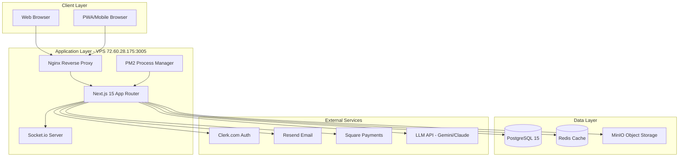

# Tax Genius Platform - Architecture Documentation

**Version:** 3.0 FINAL
**Date:** October 9, 2025
**Status:** Active - Single Source of Truth
**Platform:** taxgeniuspro.tax (Port 3005)

---

## 📑 Architecture Document Index

This architecture has been sharded into focused, manageable documents for easier navigation and maintenance.

### Core Architecture Documents

1. **[01-overview.md](01-overview.md)** - Executive summary, system architecture, and technology stack
2. **[02-database-schema.md](02-database-schema.md)** - Complete Prisma schema and database design
3. **[03-api-design.md](03-api-design.md)** - API routes, patterns, and response formats
4. **[04-storage-minio.md](04-storage-minio.md)** - MinIO configuration and bucket structure
5. **[05-authentication-clerk.md](05-authentication-clerk.md)** - Clerk authentication flows and configuration
6. **[06-email-resend.md](06-email-resend.md)** - Resend email service and React Email templates
7. **[07-security.md](07-security.md)** - Security layers, PII encryption, and access control
8. **[08-deployment.md](08-deployment.md)** - PM2, Nginx, and production deployment
9. **[09-performance.md](09-performance.md)** - Caching strategy and optimization
10. **[10-ai-content.md](10-ai-content.md)** - AI content generation architecture
11. **[11-monitoring.md](11-monitoring.md)** - Application monitoring and health checks

---

## Quick Reference

### Key Architectural Decisions

- **Framework:** Next.js 15+ with App Router (Server Components + Server Actions)
- **Deployment:** Self-hosted on VPS (72.60.28.175:3005)
- **Database:** PostgreSQL 15+ with Prisma ORM
- **Authentication:** Clerk.com (migrating from Lucia)
- **Storage:** MinIO (self-hosted S3-compatible)
- **Email:** Resend (✅ deployed)
- **Real-time:** Socket.io + Web Push Notifications

### System Diagram

---

## Related Documentation

- **[Tech Stack Details](../tech-stack/)** - Comprehensive technology decisions
- **[Migration Guide](../migrations/)** - Step-by-step migration instructions
- **[MVP Requirements](../prd/mvp/)** - Product specifications
- **[Epic Documents](../prd/epics/)** - Feature epics

---

## Document Navigation Tips

Each sharded document is:
- **Self-contained** - Can be read independently
- **Cross-referenced** - Links to related sections
- **Under 400 lines** - Easy to digest and maintain
- **Focused** - Covers one architectural domain

Start with [01-overview.md](01-overview.md) for a comprehensive introduction, then navigate to specific domains as needed.

---

**Last Updated:** October 9, 2025
**Next Review:** November 9, 2025
**Maintained By:** Development Team
