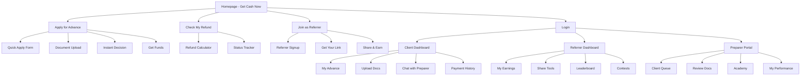
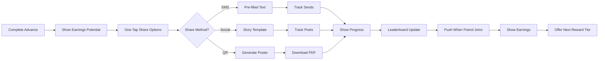
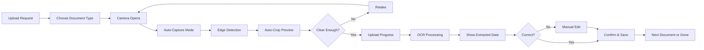

```mermaid
graph LR
    A[Land on Homepage] --> B{Has Account?}
    B -->|No| C[See $7000 Hero]
    B -->|Yes| D[Auto-Login]
    C --> E[Tap Get Cash Now]
    D --> E
    E --> F[Enter Phone Number]
    F --> G[Verify via SMS]
    G --> H[Basic Info Form]
    H --> I[Income Quick Entry]
    I --> J[Photo of W2/1099]
    J --> K[AI Processes Doc]
    K --> L{Approved?}
    L -->|Yes| M[Show Amount]
    L -->|No| N[Offer Alternatives]
    M --> O[Select Payment Method]
    O --> P[Funds Sent]
    P --> Q[Upsell Tax Prep]
    N --> R[Refer to Preparer]
```

# Tax Genius Pro - UI/UX Specification v2.0

## Introduction

This document defines the user experience goals, information architecture, user flows, and visual design specifications for Tax Genius Pro's mobile-first transformation. It serves as the foundation for redesigning the platform from a generic B2B SaaS into an urgency-driven, consumer-focused tax preparation ecosystem that resonates with gig workers and cash-based businesses.

### Overall UX Goals & Principles

#### Target User Personas

**Primary Persona - The Gig Hustler**
- Age: 25-35, urban/suburban
- Works multiple gig jobs (Uber, DoorDash, TaskRabbit)
- Needs money TODAY, not in 2 weeks
- Primarily uses smartphone for everything
- Skeptical of traditional financial services
- Values speed over features

**Secondary Persona - The Cash Business Owner**
- Age: 30-45, urban
- Runs cash-based business (salon, food truck, DJ)
- Needs help maximizing deductions
- Wants personal relationship with preparer
- Spanish may be primary language
- Values trust and community recommendations

**Tertiary Persona - The Referral Hustler**
- Age: 20-30, highly social
- Active on social media
- Always looking for side income
- Competitive and status-driven
- Values gamification and recognition
- Mobile-native user

#### Usability Goals

1. **Speed to Money**: Users can apply for cash advance in <5 minutes
2. **One-Thumb Operation**: All critical actions accessible with thumb on mobile
3. **Zero Training Required**: Intuitive enough for low digital literacy users
4. **Instant Gratification**: Every action provides immediate feedback
5. **Trust at First Sight**: Security and legitimacy apparent immediately

#### Design Principles

1. **Urgency Over Elegance** - Red/orange CTAs, countdown timers, "TODAY" messaging
2. **Show Me The Money** - Dollar amounts, refund calculators, earnings visible everywhere
3. **Social Proof Everywhere** - Testimonials, user counts, success stories on every screen
4. **Mobile-Only Thinking** - If it doesn't work on a phone, it doesn't ship
5. **Progressive Disclosure** - Start simple, reveal complexity only when needed

### Change Log
| Date | Version | Description | Author |
|------|---------|-------------|---------|
| 2025-01-14 | 2.0 | Complete mobile-first UX redesign | Mary (Analyst) |

## Information Architecture (IA)

### Site Map / Screen Inventory



### Navigation Structure

**Primary Navigation:** Bottom tab bar (mobile) with 4 items:
- 💵 Cash Now (Homepage/Apply)
- 📱 Dashboard (Contextual based on user role)
- 🎯 Refer (Share & Earn)
- 👤 Account (Profile/Settings)

**Secondary Navigation:** Hamburger menu for less-frequent actions:
- About Us
- Help/FAQ
- Contact Support
- Language Toggle (EN/ES)
- Desktop View (escape hatch)

**Breadcrumb Strategy:** None - mobile users don't use breadcrumbs. Use back buttons and clear screen titles instead.

## User Flows

### Flow 1: Emergency Cash Advance Flow (Primary Conversion)

**User Goal:** Get cash advance as quickly as possible

**Entry Points:**
- Homepage hero CTA
- Social media ad
- Referral link
- SMS campaign

**Success Criteria:** User receives approval and funds information within 5 minutes

#### Flow Diagram



#### Edge Cases & Error Handling:
- Phone already registered → Direct to login
- Document unclear → Manual review queue
- Amount too high → Offer partial advance
- Technical error → Save progress, allow resume
- No W2/1099 → Educational content about eligibility

**Notes:** Every screen shows progress bar at top. "Need help?" chat bubble always visible.

### Flow 2: Viral Referral Loop

**User Goal:** Share with friends to earn rewards

**Entry Points:**
- Post-advance success screen
- Dashboard prompt
- Email campaign
- Contest announcement

**Success Criteria:** User generates at least 3 referral link shares

#### Flow Diagram



#### Edge Cases & Error Handling:
- Share fails → Retry with different method
- No social accounts → Focus on SMS/QR
- Referral disputes → Clear tracking history
- Reward delays → Transparent status updates

**Notes:** Gamification elements (points, streaks, badges) visible throughout flow.

### Flow 3: Document Upload (Mobile-Optimized)

**User Goal:** Upload tax documents using phone camera

**Entry Points:**
- Advance application
- Dashboard reminder
- Push notification
- Preparer request

**Success Criteria:** Clear document uploaded and processed in <60 seconds

#### Flow Diagram



#### Edge Cases & Error Handling:
- Low light → Flash guidance
- Multiple pages → Batch capture mode
- Wrong document → Clear type selector
- Processing fails → Manual review option
- Large file → Automatic compression

**Notes:** AI-powered document recognition suggests document type. Progress saved after each successful upload.

## Wireframes & Mockups

### Design Files
**Primary Design Files:** Figma - [To be created based on this spec]

### Key Screen Layouts

#### Mobile Homepage (iPhone 12 Pro)
```
┌─────────────────────────┐
│ 🌐 EN|ES    Tax Genius  │
├─────────────────────────┤
│                         │
│  💰 GET UP TO $7,000    │
│       TODAY!            │
│                         │
│ ┌─────────────────────┐ │
│ │   GET CASH NOW →    │ │
│ └─────────────────────┘ │
│                         │
│ ⏱️ 1,247 people got     │
│ cash in last hour       │
│                         │
│ ⭐⭐⭐⭐⭐ 4.9 (5,421)   │
│                         │
│ ┌─────────────────────┐ │
│ │ 📸 How It Works     │ │
│ │ 1. Upload W2 (30s)  │ │
│ │ 2. Get approved     │ │
│ │ 3. Cash in account  │ │
│ └─────────────────────┘ │
│                         │
│ "Got $5K in 10 minutes!"│
│ - Maria G., Uber Driver │
│                         │
│ [Calculate My Refund]   │
│                         │
│ Already member? Login   │
├─────────────────────────┤
│ 💵 │ 📱 │ 🎯 │ 👤     │
└─────────────────────────┘
```

#### Quick Apply Screen
```
┌─────────────────────────┐
│ ← Back    Step 1 of 4   │
├─────────────────────────┤
│ ████░░░░░░░░░░░░░░░░   │
├─────────────────────────┤
│                         │
│ 📱 What's your phone?   │
│                         │
│ ┌─────────────────────┐ │
│ │ (___) ___-____      │ │
│ └─────────────────────┘ │
│                         │
│ We'll text you a code   │
│                         │
│ ┌─────────────────────┐ │
│ │    CONTINUE →       │ │
│ └─────────────────────┘ │
│                         │
│ 🔒 Your info is secure  │
│ 256-bit encryption      │
│                         │
│                         │
│ Need help? Chat with us │
└─────────────────────────┘
```

## Visual Design Specifications

### Color Palette

#### Primary Colors
- **Urgency Red**: #FF4444 - CTAs, urgent messaging
- **Money Green**: #00C853 - Approved, earnings, success
- **Trust Blue**: #2196F3 - Security, help, information
- **Cash Orange**: #FF9800 - Promotional, contests

#### Neutral Colors
- **Rich Black**: #1A1A1A - Primary text
- **Medium Gray**: #666666 - Secondary text
- **Light Gray**: #E0E0E0 - Borders, dividers
- **Off White**: #FAFAFA - Backgrounds

#### Semantic Colors
- **Error**: #F44336
- **Warning**: #FFC107
- **Success**: #4CAF50
- **Info**: #2196F3

### Typography

#### Font Stack
- **Primary**: -apple-system, BlinkMacSystemFont, 'Segoe UI', Roboto, Oxygen
- **Numeric**: 'SF Mono', Monaco, monospace (for dollar amounts)

#### Type Scale (Mobile)
- **Hero**: 32px/1.2 - Bold
- **Title**: 24px/1.3 - Semibold
- **Subtitle**: 18px/1.4 - Medium
- **Body**: 16px/1.5 - Regular
- **Caption**: 14px/1.4 - Regular
- **Micro**: 12px/1.3 - Regular

### Interactive Elements

#### Buttons
- **Primary CTA**:
  - Height: 56px (mobile), 48px (desktop)
  - Border radius: 28px
  - Background: Linear gradient (Urgency Red → Cash Orange)
  - Text: White, 18px, Semibold
  - Shadow: 0 4px 6px rgba(255,68,68,0.3)

- **Secondary Button**:
  - Height: 48px
  - Border radius: 24px
  - Background: White
  - Border: 2px solid Urgency Red
  - Text: Urgency Red, 16px, Medium

#### Form Fields
- **Input Height**: 52px (mobile)
- **Border**: 2px solid #E0E0E0
- **Focus Border**: 2px solid Trust Blue
- **Border Radius**: 8px
- **Font Size**: 18px (prevents zoom on iOS)
- **Padding**: 16px

#### Cards
- **Border Radius**: 16px
- **Shadow**: 0 2px 8px rgba(0,0,0,0.1)
- **Padding**: 20px
- **Background**: White

### Animations & Transitions

#### Micro-interactions
- **Button Press**: Scale 0.95, duration 100ms
- **Page Transitions**: Slide left/right, duration 300ms
- **Loading States**: Pulsing skeleton screens
- **Success Feedback**: Checkmark animation, confetti burst
- **Money Counter**: Rapid increment animation for dollar amounts

#### Attention Grabbers
- **CTA Pulse**: Subtle grow/shrink animation every 3 seconds
- **Countdown Timer**: Red text with shake animation in final 10 seconds
- **New Badge**: Bouncing animation on first view
- **Notification Dot**: Breathing animation

### Component Specifications

#### Bottom Navigation Bar
```
Height: 64px
Background: White
Border Top: 1px solid #E0E0E0
Icons: 24px, inactive: #666, active: Urgency Red
Labels: 12px, inactive: #666, active: Urgency Red
Active Indicator: 4px bar above icon
```

#### Progress Indicator
```
Height: 4px
Background: #E0E0E0
Fill: Linear gradient (Money Green → Cash Orange)
Animation: Smooth fill from left to right
```

#### Trust Badges
```
Size: 32px × 32px icons
Arrangement: Horizontal scroll on mobile
Spacing: 16px between badges
Includes: SSL, BBB, Norton, TrustPilot
```

#### Testimonial Cards
```
Min Height: 120px
Profile Image: 48px circle
Name: 16px Semibold
Role/Job: 14px Regular, #666
Quote: 16px Regular, italic
Rating: 5 yellow stars
```

## Responsive Breakpoints

### Mobile-First Breakpoints
- **Base (Mobile)**: 0-639px
- **Tablet**: 640px-1023px
- **Desktop**: 1024px-1279px
- **Wide**: 1280px+

### Critical Mobile Optimizations
1. **Touch Targets**: Minimum 44×44px
2. **Thumb Zone**: Primary actions in bottom 50% of screen
3. **Font Sizes**: Minimum 16px to prevent zoom
4. **Viewport**: `width=device-width, initial-scale=1, maximum-scale=5`
5. **Orientation**: Support both portrait and landscape

## Accessibility Standards

### WCAG AA Compliance
- **Color Contrast**: 4.5:1 for normal text, 3:1 for large text
- **Focus Indicators**: Visible keyboard focus on all interactive elements
- **Alt Text**: Descriptive text for all images and icons
- **ARIA Labels**: Proper labeling for screen readers
- **Semantic HTML**: Proper heading hierarchy and landmarks

### Mobile Accessibility
- **Large Touch Targets**: 44×44px minimum
- **Gesture Alternatives**: All gestures have tap alternatives
- **Motion Control**: Respect reduced motion preferences
- **Screen Reader**: Optimized for VoiceOver (iOS) and TalkBack (Android)

## Interaction Patterns

### Mobile Gestures
- **Swipe Right**: Back/Cancel
- **Swipe Left**: Next/Continue
- **Swipe Down**: Refresh (with loading animation)
- **Swipe Up**: Show more content
- **Long Press**: Show contextual menu
- **Pinch**: Zoom documents only

### Feedback Patterns
- **Loading**: Skeleton screens, not spinners
- **Success**: Green checkmark + haptic feedback
- **Error**: Red shake animation + clear message
- **Processing**: Progress bar with percentage
- **Empty States**: Illustration + action to fix

### Data Entry Patterns
- **Phone Number**: Auto-format as user types
- **SSN**: Masked with option to reveal
- **Dollar Amounts**: Large numeric keypad
- **Document Upload**: Camera-first, gallery second
- **Date Selection**: Native date picker

## Platform-Specific Considerations

### iOS Optimizations
- Safe area insets for notch
- Haptic feedback for actions
- Apple Pay integration
- Face ID/Touch ID for login
- Share sheet integration

### Android Optimizations
- Material Design components where appropriate
- Back button behavior
- Google Pay integration
- Biometric authentication
- Share intent handling

### PWA Features
- Install prompt after successful advance
- Push notifications for status updates
- Offline message when connection lost
- Background sync for uploads
- App icon with notification badge

## Performance Targets

### Mobile Performance
- **First Contentful Paint**: <1.5s
- **Time to Interactive**: <3.0s
- **Largest Contentful Paint**: <2.5s
- **Cumulative Layout Shift**: <0.1
- **JavaScript Bundle**: <200KB gzipped

### Image Optimization
- WebP format with JPEG fallback
- Responsive images with srcset
- Lazy loading below the fold
- Blur-up placeholders
- Maximum 100KB for hero images

## Next Steps

### Implementation Priority
1. Mobile homepage with urgency messaging
2. Quick apply flow with camera upload
3. Bottom navigation implementation
4. Spanish language toggle
5. PWA configuration
6. Push notification system
7. Referral sharing tools
8. Dashboard optimizations

### Design Validation
- User testing with target personas
- A/B testing CTAs and messaging
- Heat map analysis of touch patterns
- Conversion funnel optimization
- Accessibility audit

This specification provides the complete UX foundation for transforming Tax Genius Pro into a mobile-first, urgency-driven platform that resonates with gig workers and drives viral growth through referrals.