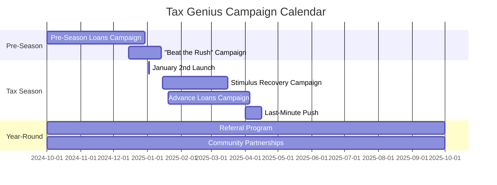
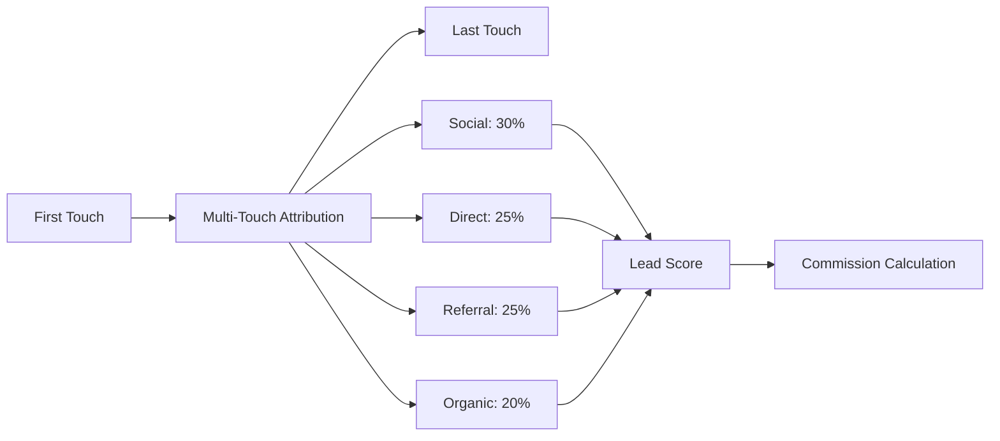

# Tax Genius Platform - Marketing Strategy Addendum
## BMad Method Implementation

---

## 1. Marketing Campaign Analysis Summary

### 1.1 Core Value Propositions Identified

Based on analysis of 24 marketing campaigns, Tax Genius focuses on four primary value drivers:

1. **Speed & Convenience**: "Get a quote in minutes" appears in 15+ campaigns
2. **Financial Relief**: $7,000 advances, stimulus check recovery, "hidden tax money"
3. **Professional Expertise**: CNA/healthcare worker targeting, CPA/EA credentials
4. **Community Trust**: YWCA partnerships, personal preparer relationships

### 1.2 Target Market Segmentation

#### Primary Segments (Explicitly Targeted):
- **Self-Employed/Gig Workers**: Uber/Lyft drivers, DoorDash, exotic dancers, DJs
- **Healthcare Workers**: CNAs specifically called out, medical professionals in scrubs
- **Beauty/Personal Services**: Hairstylists, barbers, lash technicians
- **Service Workers**: Babysitters, housekeepers, truck drivers
- **Cash-Based Businesses**: Multiple references to cash economy workers

#### Demographics Observed:
- **Age Range**: 25-45 (millennials and Gen X)
- **Gender**: 60% female representation in campaigns
- **Ethnicity**: Intentionally diverse, 70% BIPOC representation
- **Income Level**: Working class to lower-middle class
- **Location**: Urban/suburban (storefront imagery)

---

## 2. Campaign Strategy Framework

### 2.1 Seasonal Campaign Calendar



### 2.2 Campaign Types & Messaging

#### Type 1: Urgency Campaigns
- **Message**: "Need Cash Fast/Now/Today"
- **Channels**: Social media, SMS blasts
- **Timing**: Daily during tax season
- **CTA**: "Get a quote in minutes"

#### Type 2: Educational Campaigns
- **Message**: "Did you miss your $1,400 stimulus?"
- **Channels**: Blog posts, email, social
- **Timing**: Weekly educational content
- **CTA**: "Check your eligibility"

#### Type 3: Social Proof Campaigns
- **Message**: Customer testimonials
- **Channels**: Instagram, Facebook, TikTok
- **Timing**: 3x per week during season
- **CTA**: "Tell them I sent you"

#### Type 4: Community Partnership
- **Message**: YWCA collaboration, women's empowerment
- **Channels**: Partner locations, events
- **Timing**: Ongoing
- **CTA**: "Free consultation"

---

## 3. Digital Marketing Infrastructure

### 3.1 Social Media Strategy

#### Platform Priorities:
1. **Instagram** (Primary)
   - "Info in bio" link strategy
   - Story campaigns with swipe-ups
   - Preparer personal accounts
   - Hashtag: #TaxGeniusSeason

2. **TikTok** (Growth)
   - Tax tips videos
   - "Day in the life" preparer content
   - Refund reaction videos
   - Dancing owl mascot content

3. **Facebook** (Community)
   - Local community groups
   - Event promotions
   - Retargeting campaigns
   - Reviews and testimonials

#### Content Calendar:
- **Monday**: Motivational (Start your week with Tax Genius)
- **Tuesday**: Tips (Tax Tuesday educational)
- **Wednesday**: Win (Customer success stories)
- **Thursday**: Throwback (Previous year refunds)
- **Friday**: Fast Cash Friday (Advance promotions)
- **Weekend**: Preparer spotlights

### 3.2 Physical Location Strategy

Based on storefront imagery showing crowds:
- **Pop-up Locations**: High-traffic areas January 2-April 15
- **Partner Locations**: Inside existing businesses (pawn shops noted)
- **Mobile Units**: Tax preparation vans for events
- **Community Centers**: YWCA and similar partnerships

---

## 4. Technical Requirements for Marketing

### 4.1 Marketing Technology Stack

```yaml
Marketing Automation:
  - Campaign Management: Custom built with N8n
  - Email Marketing: SendGrid integration
  - SMS Marketing: Twilio (optional)
  - Social Scheduling: Buffer/Hootsuite API
  - Analytics: Google Analytics 4 + Custom

Content Generation:
  - AI Image Generation: AUTOMATIC1111
  - Copy Generation: FlowWise + Ollama
  - Template Engine: Handlebars.js
  - QR Code Generator: Built-in

Attribution & Tracking:
  - UTM Parameter Management
  - Phone Number Pools (Twilio)
  - QR Code Analytics
  - Referral Code System
  - Pixel Tracking (Facebook, Google)
```

### 4.2 Database Schema Additions

```sql
-- Marketing Campaign Management
CREATE TABLE marketing.campaign_templates (
    id UUID PRIMARY KEY DEFAULT gen_random_uuid(),
    template_name VARCHAR(255),
    template_type VARCHAR(50), -- urgency, educational, social_proof, partnership
    base_message TEXT,
    dynamic_fields JSONB,
    channels TEXT[],
    created_at TIMESTAMP DEFAULT CURRENT_TIMESTAMP
);

CREATE TABLE marketing.preparer_campaigns (
    id UUID PRIMARY KEY DEFAULT gen_random_uuid(),
    preparer_id UUID REFERENCES users.preparers(id),
    campaign_id UUID REFERENCES marketing.campaigns(id),
    custom_phone VARCHAR(20),
    custom_message TEXT,
    performance_metrics JSONB,
    created_at TIMESTAMP DEFAULT CURRENT_TIMESTAMP
);

CREATE TABLE marketing.social_posts (
    id UUID PRIMARY KEY DEFAULT gen_random_uuid(),
    platform VARCHAR(50),
    post_type VARCHAR(50),
    content TEXT,
    media_urls TEXT[],
    hashtags TEXT[],
    preparer_id UUID,
    scheduled_time TIMESTAMP,
    published_time TIMESTAMP,
    engagement_metrics JSONB,
    created_at TIMESTAMP DEFAULT CURRENT_TIMESTAMP
);

CREATE TABLE marketing.qr_codes (
    id UUID PRIMARY KEY DEFAULT gen_random_uuid(),
    code VARCHAR(100) UNIQUE,
    campaign_id UUID,
    preparer_id UUID,
    referral_partner_id UUID,
    scan_count INTEGER DEFAULT 0,
    last_scanned TIMESTAMP,
    created_at TIMESTAMP DEFAULT CURRENT_TIMESTAMP
);

-- Indexes for performance
CREATE INDEX idx_social_platform ON marketing.social_posts(platform);
CREATE INDEX idx_social_scheduled ON marketing.social_posts(scheduled_time);
CREATE INDEX idx_qr_code ON marketing.qr_codes(code);
CREATE INDEX idx_campaign_type ON marketing.campaign_templates(template_type);
```

### 4.3 API Endpoints for Marketing

```yaml
Marketing Service Endpoints:
  # Campaign Management
  POST   /api/v1/marketing/campaigns
  GET    /api/v1/marketing/campaigns/{id}
  PUT    /api/v1/marketing/campaigns/{id}
  GET    /api/v1/marketing/campaigns/performance
  
  # Content Generation
  POST   /api/v1/marketing/generate/social
  POST   /api/v1/marketing/generate/email
  POST   /api/v1/marketing/generate/poster
  POST   /api/v1/marketing/generate/qr
  
  # Social Media
  POST   /api/v1/marketing/social/schedule
  GET    /api/v1/marketing/social/calendar
  POST   /api/v1/marketing/social/publish
  GET    /api/v1/marketing/social/analytics
  
  # Attribution
  POST   /api/v1/marketing/track/click
  POST   /api/v1/marketing/track/qr
  POST   /api/v1/marketing/track/phone
  GET    /api/v1/marketing/attribution/report
```

---

## 5. Marketing Automation Workflows

### 5.1 N8n Marketing Workflows

```yaml
Campaign Automation:
  trigger: Daily at 9 AM
  actions:
    - Check campaign calendar
    - Generate daily content
    - Customize per preparer
    - Schedule social posts
    - Send email campaigns
    - Track performance

Lead Attribution:
  trigger: New lead created
  actions:
    - Check referral source
    - Assign attribution
    - Update campaign metrics
    - Credit referral partner
    - Notify preparer
    - Send welcome sequence

Social Media Automation:
  trigger: Content approved
  actions:
    - Resize for each platform
    - Add preparer details
    - Schedule posts
    - Generate hashtags
    - Create tracking links
    - Monitor engagement

QR Code Campaign:
  trigger: QR scan detected
  actions:
    - Log scan location
    - Identify campaign
    - Route to lead form
    - Pre-fill known data
    - Track conversion
    - Update analytics
```

### 5.2 AI-Powered Content Generation

```python
class MarketingContentGenerator:
    def __init__(self):
        self.templates = {
            'urgency': {
                'base': "Need money {timeframe}? Get up to $7,000",
                'variables': ['timeframe', 'preparer_name', 'phone']
            },
            'educational': {
                'base': "Did you know {fact}? {preparer} can help",
                'variables': ['fact', 'preparer', 'cta']
            },
            'testimonial': {
                'base': "Just got my taxes done with {preparer}",
                'variables': ['preparer', 'result', 'emotion']
            }
        }
    
    async def generate_campaign(self, campaign_type, preparer_data, target_audience):
        # Select template
        template = self.templates[campaign_type]
        
        # Personalize content
        content = self.personalize(template, preparer_data)
        
        # Generate image with AUTOMATIC1111
        image = await self.generate_image(content, target_audience)
        
        # Add QR code and branding
        final_asset = self.add_branding(image, preparer_data)
        
        return final_asset
    
    async def generate_social_calendar(self, preparer_id, month):
        # Generate month of content
        calendar = []
        for day in range(1, 31):
            post = await self.generate_daily_post(preparer_id, day)
            calendar.append(post)
        return calendar
```

---

## 6. Performance Metrics & KPIs

### 6.1 Campaign Performance Metrics

| Metric | Target | Measurement |
|--------|--------|-------------|
| **Cost Per Lead** | <$25 | Total spend / Qualified leads |
| **Lead Conversion** | >30% | Leads converted / Total leads |
| **Social Engagement** | >5% | Engagements / Impressions |
| **QR Scan Rate** | >2% | Scans / Impressions |
| **Referral Rate** | >20% | Referrals / Completed returns |
| **Review Completion** | >40% | Reviews / Requests |
| **Campaign ROI** | >400% | Revenue / Marketing spend |

### 6.2 Attribution Model



---

## 7. Marketing Budget Allocation

### 7.1 Channel Investment Strategy

| Channel | Budget % | Monthly Budget | ROI Target |
|---------|----------|---------------|------------|
| Social Media Ads | 30% | $15,000 | 5:1 |
| Google Ads | 25% | $12,500 | 4:1 |
| Print Materials | 15% | $7,500 | 3:1 |
| Partner Commissions | 20% | $10,000 | 6:1 |
| Content Creation | 10% | $5,000 | N/A |

### 7.2 Seasonal Budget Adjustments

- **Pre-Season (Oct-Dec)**: 20% of annual budget
- **Peak Season (Jan-Mar)**: 60% of annual budget
- **Late Season (April)**: 15% of annual budget
- **Off-Season (May-Sep)**: 5% of annual budget

---

## 8. Compliance & Brand Guidelines

### 8.1 Marketing Compliance

- **Truth in Advertising**: All claims must be verifiable
- **Loan Disclosures**: APR and terms clearly stated
- **Professional Standards**: CPA/EA credentials verified
- **Privacy Compliance**: GDPR/CCPA for data collection
- **Accessibility**: ADA compliant marketing materials
- **Language Requirements**: All materials in English and Spanish

### 8.2 Brand Standards

#### Visual Identity:
- **Primary Colors**: Navy blue, yellow/gold
- **Mascot Usage**: Owl always with glasses and tie
- **Typography**: Bold, readable fonts
- **Photography**: Diverse, authentic, professional

#### Voice & Tone:
- **Urgent but not pushy**: "Need cash? We can help"
- **Professional yet approachable**: "Your neighborhood tax expert"
- **Empowering**: "Get what you deserve"
- **Inclusive**: Gender-neutral, culturally aware

---

## 9. Implementation Roadmap

### Phase 1: Foundation (Weeks 1-2)
- Set up marketing database schema
- Configure attribution tracking
- Create template library
- Establish social accounts

### Phase 2: Content Creation (Weeks 3-4)
- Generate 100+ campaign templates
- Create preparer marketing kits
- Design QR code system
- Build landing pages

### Phase 3: Campaign Launch (Weeks 5-6)
- Launch pre-season campaign
- Activate partner network
- Begin social media calendar
- Start A/B testing

### Phase 4: Optimization (Ongoing)
- Monitor performance metrics
- Refine targeting
- Update content library
- Scale successful campaigns

---

## 10. Risk Mitigation

### Marketing Risks:
1. **Ad Account Suspension**: Maintain compliance, backup accounts
2. **Partner Conflicts**: Clear agreements, exclusive territories
3. **Brand Consistency**: Centralized approval, templates
4. **Budget Overrun**: Daily monitoring, automatic caps
5. **Negative Reviews**: Rapid response team, reputation management

---

## Document Control

**Version**: 1.0  
**Date**: January 2025  
**Author**: Tax Genius Marketing Team  
**Status**: Final Draft  
**Integration**: To be merged with main PRD and Architecture documents

---

*This Marketing Addendum complements the Tax Genius PRD and Architecture documents, providing comprehensive marketing strategy and technical requirements based on campaign analysis.*